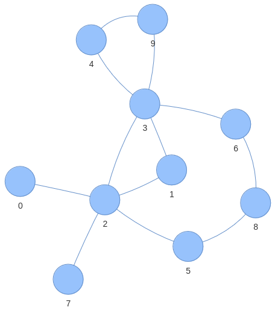

# Laboratorio 8
Gli obiettivi principali di questo laboratorio sono:
- funzioni lambda
- callable classes (\_\_call\_\_) 
- inner functions, closure e closure factory

Inoltre si lavorerà sui alberi binari e grafi.


## Esercizio 1
Sviluppare la classe *SortableCouple*, rappresentante una coppia di valori floating point *(a, b)*.
Il costruttore accetta come parametri i due valori della coppia.
Questi sono anche ottenibili tramite getters.

La classe implementa il metodo ```__repr__(self) -> str``` e il metodo ```__lt__(self, other) -> bool```.
Il secondo confronta le coppie secondo la somma dei valori *a* e *b*. 
Scrivere un main che crei una lista di *SortableCouple* e la riordini tramite il metodo sort.

Successivamente passare come parametro *key* del metodo sort una funzione lambda che,
preso come parametro una *SortableCouple*, restituisca il prodotto *a\*b*.
Questa specifica un altro metodo di confronto delle *SortableCouple*,
usando come valore di confronto il prodotto dei valori contenuti.
Verificare il nuovo ordinamento.

Scrivere una classe *CoupleSorter* che contenga unicamente il metodo ```__call__(self, elm: SortableCouple) -> float``` che,
ricevuto come parametro una *SortableCouple*, restituisca il la differenza *a - b*.

Nel main, creare un'istanza di questa classe e passarla come parametro *key* del metodo sort che riordina la lista.
Similmente a prima, il metodo sort userà ```__call__(self, elm: SortableCouple) -> float``` sulle *SortableCouple*
per ottenere il valore con cui confrontarle.
Verificare il nuovo ordinamento.


## Esercizio 2
Sviluppare la classe *WeightedSorter* per definire un nuovo ordinamento delle *SortableCouple*.
Il costruttore accetta come parametro un valore floating point compreso nel'intervallo [0, 1],
rappresentante il peso (*weight*).
Esso deve essere ottenibile tramite un getter e modificabile tramite un setter.
Il metodo ```__call__(self, elm: SortableCouple) -> float```, restituisce un valore di confronto della *SortableCouple*
definito come segue:
``` python
a * weight + b * (1 - weight)
```
Nel main creare una lista di *SortableCouple*
e un'istanza della classe *WeightedSorter* da passare come parametro *key* del metodo sort della lista.
Come si può notare è possibile personalizzare il tipo di ordinamento
creando istanze apposite della classe *WeightedSorter*.

Definire una closure factory (funzione di secondo ordine) che, preso il peso *weight* come parametro,
restituisca una seconda funzione (closure). 
La funzione restituita accetta una *SortedCouple* come parametro
e restituisce lo stesso valore di confronto definito precedentemente, tramite l'utilizzo del peso *weight*.
Equivalentemente al caso precedente è possibile personalizzare il tipo di ordinamento
fornendo valori diversi di *weight* alla closure factory.

Verificare che in entrambi i casi si ottiene il medesimo ordinamento della lista.


## Esercizio 3
Scrivere una classe che implementi un albero binario di ricerca.
Nel file *es3_template.py* è fornito lo scheletro della classe e un main che testa le funzionalità base.

La classe deve fornire le seguenti funzionalità:
- permettere l'inserimento di valori (```add(self, key: Any) -> None```)
- sapere il numero di elementi contenuti (```__len__(self) -> int```)
- trovare il minimo dei valori inseriti (```min(self) -> Any```)
- avere una rappresentazione in stringa (```\_\_repr\_\_(self) -> str```)
che contenga i valori aggiunti in modo ordinato
(leggerli dall'albero in modo ordinato, tramite l'algoritmo opportuno,
**NON** ordinarli tramite un algoritmo di sorting).

**SUGGERIMENTO:** creare due classi separate,
una rappresentate l'albero
e l'altra rappresentante i suoi nodi.
I nodi conterranno i valori aggiunti all'albero
e i riferimenti ai due nodi figlio.


## Esercizio 4
Scrivere una classe che implementi una grafo **INDIRETTO** **NON PESATO**
utilizzando una **MATRICE DI ADIACENZE**.
La dimensione N del grafo è definita tramite costruttore, e non può essere cambiata.
I nodi del grafo sono identificati da numeri da 0 a N-1.

Partendo dallo scheletro della classe *Graph* fornito in *es4_template.py* implementare:
- il metodo ```connect(self, node_1: int, node_2: int) -> None``` che permette l'aggiunta di rami tra i nodi
- il metodo ```are_connected(self, node_1: int, node_2: int) -> bool```, per controllare se due nodi sono connessi da un ramo.
- il metodo ```get_connected(self, node: int) -> Container[int]```che restituisce i nodi connessi a quello passato come parametro.
- il metodo ```__len__(self) -> int``` che restituisce il numero di nodi nel grafo
- il metodo ```__str__(self) -> str``` che restituisce una stringa rappresentante la matrice di adiacenze in modo leggibile.

Scrivere un main che usi la classe per rappresentare il grafo in figura e testi l'implementazione.


